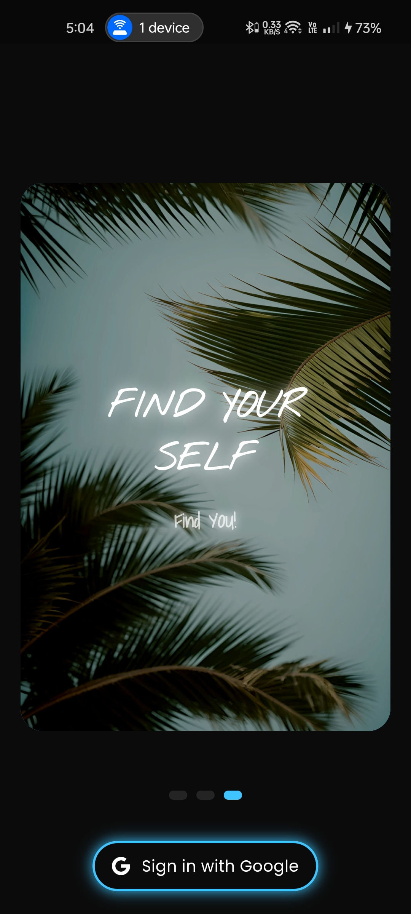
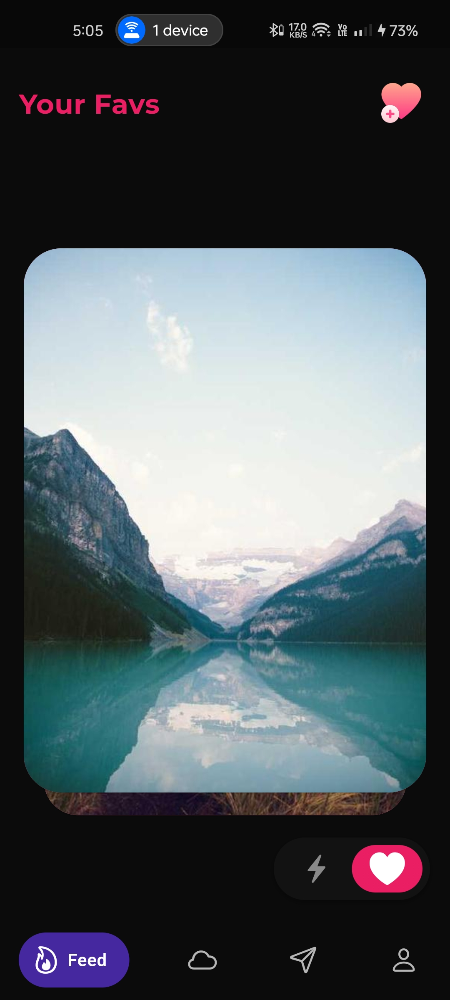
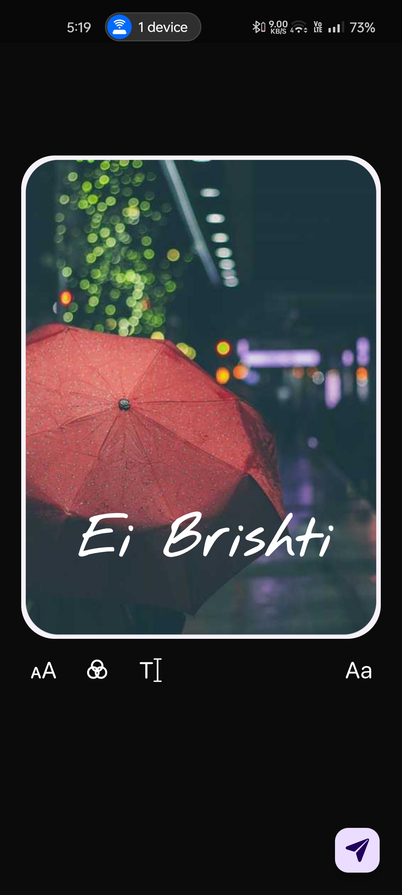
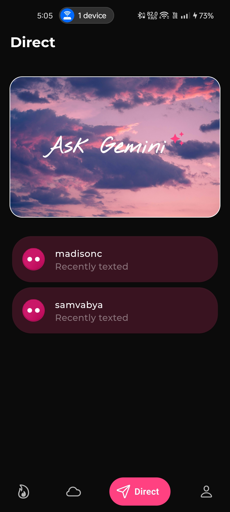
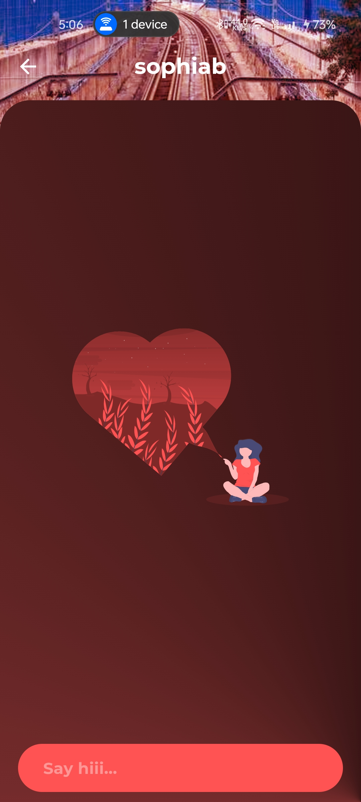
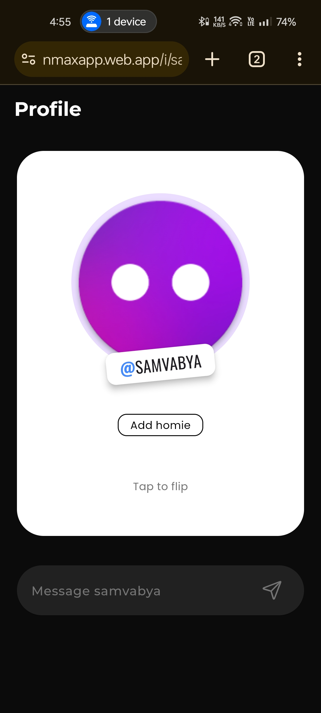
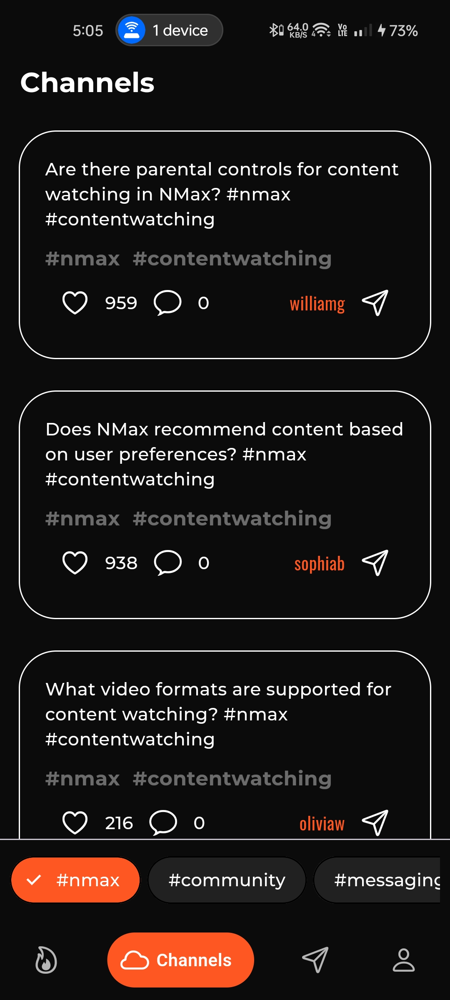
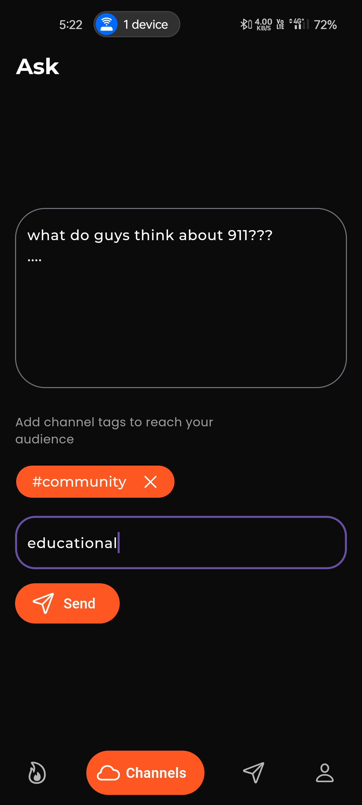
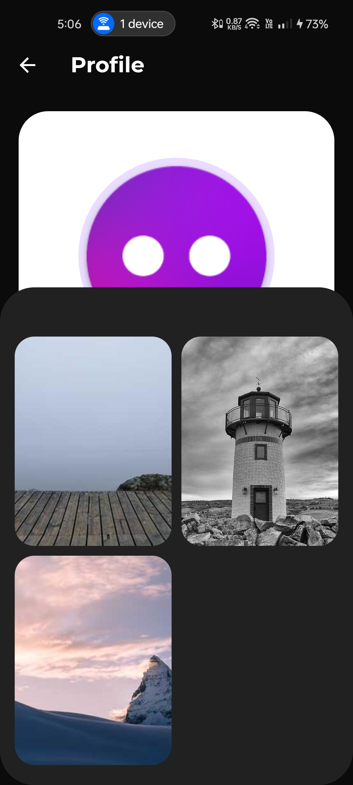

    
    <h1>NMAX</h1>
    
A cross-platform app for socializing...

---

  
  
  
 
  
  
  
 
  
  
  

## Features
- Infinite scrolling
- Meme posting
- Story posting
- Community posting
- Community channels
- Private chatting
- Ask Gemini™
- Cross platform
- ...

## Installation

## Tech Stack

**Client:** Flutter, Android, Web

**Server:** Firebase, Google Cloud, Cloudinary

**APIs:** Gemini, News, Pexels, Lorem Picsum
